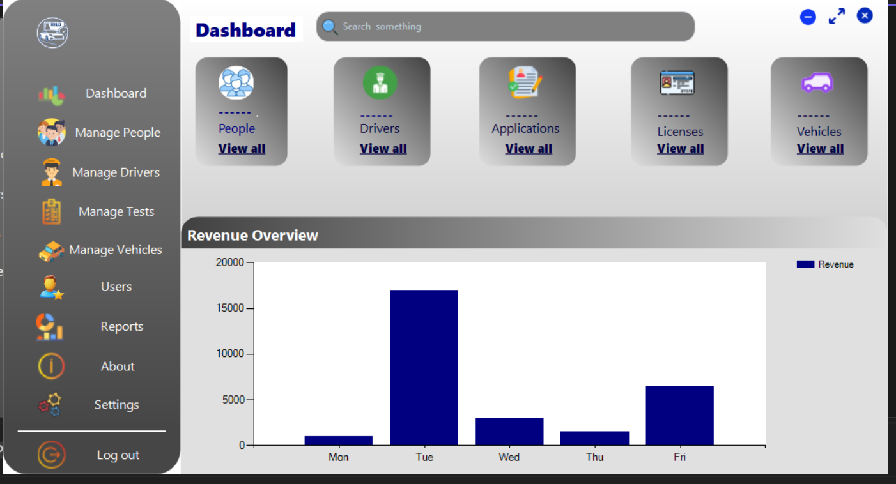

## 🚧 Current Project

# 🚗 DVLD - Driving License Management System

## 📸 Screenshots



# DVLD - Driving License Management System

A Windows Forms application for managing driving licenses and related operations.

## Project Architecture

The project is organized using a layered architecture to separate responsibilities and make the system easier to maintain, develop, and extend.

### 1. Presentation Layer

The Presentation Layer contains the Windows Forms user interface and handles interaction with the user.

It includes:

- `ApplicationsTypes/` - Application type related forms and functionality
- `People/` - Forms for managing people
- `Users/` - Forms for managing system users
- `Properties/` - Project properties
- `Resources/` - Application resources
- `Settings/` - Application settings
- `App.config` - Application configuration
- `Form1.cs` - Main form
- `Form1.Designer.cs` - Main form designer code
- `Form1.resx` - Main form resources
- `Program.cs` - Application entry point
- `usControlPanel.cs` - Control panel user control
- `usControlPanel.Designer.cs` - Control panel designer code
- `usControlPanel.resx` - Control panel resources

### 2. Business Layer

The Business Layer contains the application's business logic and rules.

It is responsible for processing application operations and communicating with the Data Access Layer.

### 3. Data Access Layer

The Data Access Layer is responsible for communicating with the database.

It contains the classes and methods used to:

- Connect to the database
- Retrieve data
- Insert data
- Update data
- Delete data

### 4. DTO Project

The DTO Project contains Data Transfer Objects (DTOs) used to transfer data between the different layers of the application.

## Project Structure

```text
DVLD-Repo/
│
├── DTO Project/
│
├── Data Access Layer/
│
├── DVLD_BusinessLayer1/
│
├── Presentation Layer/
│   ├── ApplicationsTypes/
│   ├── People/
│   ├── Users/
│   ├── Properties/
│   ├── Resources/
│   ├── Settings/
│   ├── App.config
│   ├── Form1.cs
│   ├── Form1.Designer.cs
│   ├── Form1.resx
│   ├── Program.cs
│   ├── Project.csproj
│   ├── Project.sln
│   ├── usControlPanel.cs
│   ├── usControlPanel.Designer.cs
│   └── usControlPanel.resx
│
├── Images/
│
├── README.md
└── DVLD_DataAccessLayer.csproj

Architecture Flow
Presentation Layer
        ↓
Business Layer
        ↓
Data Access Layer
        ↓
Database

The DTO Project is used to transfer data between the different layers.

Technologies
C#
.NET
Windows Forms
SQL Server
ADO.NET
Visual Studio
Git
GitHub
Purpose

The main goal of this project is to build a structured Driving License Management System using a layered architecture, keeping the user interface, business logic, and database operations separated.

The project is designed to provide a clear and maintainable structure that makes it easier to develop, test, and extend the system.
